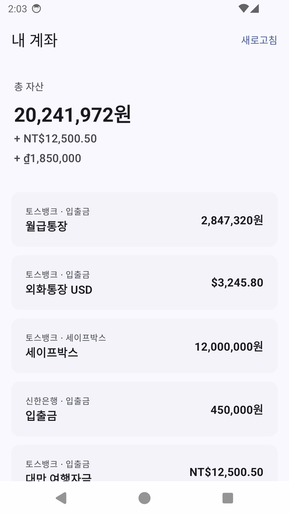

# Bank — 다통화 뱅킹 앱

> 다통화 계좌·환율 환산·송금을 다루는 Android Sample
> 
> 총 자산 · 다통화 계좌 리스팅, 4단계 송금 플로우(수취인 → 금액 → 확인 → 결과)
>
> **DDD · 멀티모듈 클린 아키텍처 · MVI · 계층별 테스트 피라미드**
>
> <sub>개인 포트폴리오 · 단독 설계·구현 · 약 2주 · 홈 / 계좌상세 / 송금 도메인</sub>


---

<p align="center">
  
  <br/>
  <sub><b>UI 계기 E2E</b> — <code>:app-e2e</code>가 실제 에뮬레이터에서 앱을 구동: 홈 → 계좌상세 → 수취인 → 금액 → 확인 → 결과(성공) · <code>TransferFlowEndToEndTest</code></sub>
</p>

---

## 목차

[빌드 & 실행](#-빌드--실행) · [아키텍처](#-아키텍처) · [설계 원칙](#-설계에서-고려한-것--tdd--solid--ddd) · [테스트 전략](#-테스트-전략) · [핵심 기능](#-핵심-기능) · [**외환 도메인**](#-외환다통화-도메인) · [기술 스택](#-기술-스택)

---

## 🚀 빌드 & 실행

```bash
# 디버그 APK 빌드
./gradlew :app:assembleDebug

# UI 계기 E2E (디바이스/에뮬레이터 필요)
./gradlew :app-e2e:connectedAndroidTest

# 특정 모듈 테스트
./gradlew :domain:test :feature:home:test

# 전체 단위·UI·데이터 E2E 테스트 (JVM)
./gradlew test
```

> 외부 API 키 없이 바로 실행됩니다 — 네트워크 호출은 내장 KFTC mock 서버로 흐릅니다.

---

## 🏛️ 아키텍처

**Clean Architecture × 멀티모듈 × DDD × MVI** 를 결합했습니다.

```
            ┌┄┄ :app-e2e (테스트 의존성 격리)
            ┊       
            ▼
            ┌─────────────────────────────────────────────┐
            │                   :app                       │  Application / MainActivity
            └───────────────┬─────────────────────────────┘  
                            │
        ┌───────────────────┼────────────────────┐
        ▼                   ▼                    ▼
   :navigation         :data-di          :core-ui:designsystem
        │      (Hilt 그래프 집결, 구현체 은닉)
        ▼                   │
  :feature:home      ┌──────┼──────────┬───────────┐
  :feature:account   ▼      ▼          ▼           ▼
  :feature:transfer :data :data:local :data:remote:kftc
        │                              :data:remote:fx
        ▼
     :domain (순수 Kotlin/JVM · 모듈 의존성 0)   ◀── :data 도 도메인에 의존 (DIP)

  화면 공용 모듈 — :feature 가 사용 (※ 도메인 계층 아님):
    :core-ui:mvi     제네릭 MVI 엔진   · 도메인 비의존 (reducer만 주입받아 확장)
    :core-ui:model   UI 표시 모델      · 도메인 비의존
    :core-ui:mapper  표시 모델 ↔ 도메인 · 이 모듈만 도메인 의존
```

### 계층 책임

- **domain** — 리치 도메인 모델(`Money`, `Currency`, `Account`, `TransferRequest`…), Repository 인터페이스, UseCase. `BigDecimal` 기반 통화-안전 연산
- **data** — Repository 구현 + DTO/Entity ↔ 도메인 매퍼. `:data:remote:kftc`(계좌·거래·송금), `:data:remote:fx`(환율), `:data:local`(Room)로 데이터 소스 분리
- **data-di** — 모든 모듈의 Hilt 모듈이 모이는 **composition root**. 앱의 실제 DI 그래프를 단일 지점에서 조립
- **feature** — 화면별 모듈. 각자 `contract`(State/Intent/Effect) + `ViewModel` + Compose UI + UI 모델/매퍼를 소유
- **core-ui** — `mvi`(공용 MVI 엔진), `model`/`mapper`(통화 표시 모델), `designsystem`(테마)
- **navigation** — feature 네비게이션 그래프를 조립하는 `BankNavHost`

---

## 🎯 설계에서 고려한 것 — TDD · SOLID · DDD

이 프로젝트는 기능 구현 자체보다 **"어떤 원칙 위에서 구현했는가"** 를 보여주는 데 무게를 뒀습니다.
아래 세 가지를 일관된 기준으로 삼았고, 모든 항목은 실제 코드로 뒷받침됩니다.

### DDD — 리치 도메인 모델

- **값 객체(Value Object)로 불변식을 타입에 새긴다.** `Money`는 `BigDecimal` 기반 불변 객체로, 서로 다른 통화 연산을 `require`로 즉시 거절합니다. `AccountNumber`·`AccountId`·`TransactionId`는 `@JvmInline value class`로 모델링해 원시 타입 혼동(primitive obsession)을 차단하고 생성 시점에 형식을 검증합니다.
- **유비쿼터스 언어를 타입으로.** 도메인 결과는 sealed interface로 명시합니다 — `TransferOutcome.Success / Failure(InsufficientFunds, CurrencyMismatch, DailyLimitExceeded …)`. "환전 ≠ 이체" 같은 도메인 규칙이 `CurrencyMismatch`라는 타입으로 드러납니다 (→ [외환 도메인](#-외환다통화-도메인)).
- **순수 도메인 레이어.** `:domain` 모듈은 안드로이드·프레임워크 의존성이 0이며, 비즈니스 규칙만 담습니다.

### SOLID

- **SRP** — 1파일 1타입 원칙. 환율 변환을 `FxRateMapper`(KEXIM 응답 파싱)와 `CurrencyRebaser`(통화 기준 재계산)로 쪼개고, KFTC mock 디스패처도 계좌/송금/실명조회 핸들러로 분리했습니다.
- **OCP** — `MviStore<S, I, E>` 제네릭 엔진은 화면별 reducer만 주입받아 확장됩니다. 통화 추가는 `Currency` enum과 매퍼 분기만 늘리면 됩니다.
- **ISP** — `AccountRepository`·`FxRateRepository`·`TransferRepository`·`TransactionRepository`·`RecipientRepository`로 좁게 분리해 클라이언트가 필요한 계약만 보게 했습니다.
- **DIP** — `:domain`이 Repository 인터페이스를 **소유**하고 `:data`가 구현합니다. 의존성은 항상 안쪽(도메인)을 향하며, UseCase는 추상에만 의존합니다.


### TDD — 테스트 가능성을 먼저 설계

- **총 287개 테스트(42개 파일)**, 테스트 피라미드 L1~L3 (→ [테스트 전략](#-테스트-전략)).
- 테스트 용이성을 위한 **설계 결정**: `MviStore`의 reducer 디스패처를 주입 가능하게 만들어 test dispatcher를 공유 → 공식 `runTest`로 결정론적 검증. 시간 의존(`Clock`)·디스패처(`DispatcherProvider`)를 모두 주입으로 노출.
- Flow는 멀티 emit이면 Turbine, 단일이면 `.first()`. Compose UI는 Robolectric으로 JVM에서, 화면 회귀는 Roborazzi 스크린샷으로 검증.

---

## 🧪 테스트 전략

**총 287개 테스트 / 42개 테스트 파일** — 테스트 피라미드 L1~L3로 구성했습니다.

```
           ╱╲
          ╱L3╲          E2E          12   계기 UI 7 · 데이터 5
         ╱────╲
        ╱  L2  ╲        Compose UI   40   Robolectric + Roborazzi 스크린샷
       ╱────────╲
      ╱    L1    ╲      단위         235  domain · data · core-ui · ViewModel/reducer
     ╱────────────╲
    ▔▔▔▔▔▔▔▔▔▔▔▔▔▔▔▔
```

> **실행 범위 주의.** `./gradlew test` 는 JVM에서 도는 **280개**(L1 235 · L2 40 · L3 데이터 5)를 실행합니다.
> 계기 UI E2E **7개**는 디바이스/에뮬레이터가 필요해 `./gradlew :app-e2e:connectedAndroidTest` 로 따로 돕니다. (280 + 7 = 287)

| 레벨 | 범위                                                     | 위치 / 도구 |
|------|--------------------------------------------------------|------------|
| **L1 단위** | 도메인 로직, 매퍼, ViewModel, reducer                         | 각 모듈 `src/test` · JUnit4 + Turbine + test dispatcher |
| **L2 Compose UI** | stateless 화면 렌더링·상호작용                                  | feature `src/test` · Robolectric + Compose UI Test (JVM에서 구동), Roborazzi 스크린샷 |
| **L3 E2E (데이터)** | UI 없이 앱의 데이터 흐름을 **실제 Hilt 그래프**를 Robolectric에서 부팅해 검증 | `:data-di/src/test` |
| **L3 E2E (UI 계기)** | `:app`을 instrument하는 네비게이션 시나리오                        | `:app-e2e` (`com.android.test`) · Hilt + 실제 화면 전환 |

- **Flow 검증**: 멀티 emit 시퀀스는 Turbine, 단일 값은 `.first()`
- **테스트 격리**: 장애 주입이 다음 테스트로 새지 않도록 `@After` 복구. E2E는 `@TestInstallIn`으로 MVI 디스패처를 Main으로 교체해 teardown 크래시 해결
- **test-only DI**: release 풋건 차단을 위해 `src/debug`로 격리

### 목 인프라

실제 외부 의존성 없이 전 계층을 결정론적으로 돌리기 위한 인-프로세스 목을 갖췄습니다.

- **KFTC v2.0 Mock 서버** — `MockWebServer` 기반. 자체서명 인증서로 **HTTPS** 제공(매니페스트 cleartext-free), `api_tran_id` 시퀀스·가변 상태로 송금/거래내역을 실제처럼 시뮬레이션. 시드 6계좌(토스뱅크 KRW/USD/TWD/VND + 신한 KRW)로 다통화 흐름이 끝까지 흐르도록 구성
- **KEXIM 환율** — 실제 응답 형태(KRW 기준·영업일 고시·미커버 통화)를 그대로 흉내 내, [외환 도메인](#-외환다통화-도메인)의 재계산·walkback·환산 불가 분기가 끝까지 검증되도록 구성

---

## ✨ 핵심 기능

| 기능 | 설명 |
|------|------|
| **홈 / 총자산** | 다통화 계좌 목록 + 목표 통화 기준 총자산 환산. 환산 불가 통화(KEXIM 미커버)는 별도 표기 |
| **계좌 상세** | 계좌 헤더 + 거래내역(입금/출금) 리스트 |
| **송금** | 수취인 입력 → 금액 입력 → 송금 확인 → 결과(로딩 → 성공/실패) 4단계 플로우. 실명조회·실제 출금 실행 |
| **장애 시뮬레이션** | 디버그 빌드에서 네트워크 장애를 주입해 에러/리트라이 경로 검증 |

---

## 💱 외환(다통화) 도메인

시드 계좌부터 KRW·USD·TWD·VND가 섞여 있고, 환율·환산·통화 경계가
모델·레포지토리·UI 전 계층에 걸쳐 있습니다.

### 1. 환율 소스 — KEXIM, KRW 기준(anchored)

한국수출입은행(KEXIM) 환율 API를 소스로 씁니다. 이 데이터의 까다로운 지점을 도메인 경계 안에서 흡수합니다.

- **KRW-anchored → target 기준 재계산.** KEXIM 응답은 "1 외화 = N원" 형태(원화 기준)입니다. `CurrencyRebaser`가 anchor 맵을 임의의 target 통화 기준으로 재계산합니다(`anchorPerSource ÷ targetRate`, scale 8 / HALF_UP). 덕분에 사용자의 표시 통화가 USD든 JPY든 동일 로직으로 환산됩니다.
- **단위·포맷 정규화.** `JPY(100)`(100엔당 고시)는 100으로 나눠 1엔 기준으로, `"1,538.29"`의 천단위 쉼표는 제거 후 파싱 — 모두 `FxRateMapper`가 처리합니다.
- **영업일 walkback.** KEXIM은 영업일 11시경 고시하고 주말·공휴일엔 데이터가 없습니다. 어제부터 최대 10일까지 거슬러 올라가 `result=1`인 응답을 찾습니다.
- **결과 코드 방어.** `result`(1=성공, 2=비영업일, 3=인증실패, 4=한도초과)를 검사해 비정상 응답을 환산 경로에서 배제합니다.

### 2. 환산 불가를 명시적으로 모델링 — `AssetTotals`

KEXIM이 모든 통화를 커버하지 않습니다(시드의 TWD·VND는 미커버). 환산할 수 없는 잔액을 **0으로 뭉개거나 숨기지 않고** 도메인 결과에 명시적으로 남깁니다.

```kotlin
data class AssetTotals(
    val converted: Money,          // target 통화로 합산된 환산 가능 자산
    val unconverted: List<Money>,  // 환율 시트에 없어 원본 통화 그대로 남은 잔액
)
```

`TotalAssetsUseCase`는 계좌 Flow와 환율 Flow를 `combine`해, 환율 맵에 통화가 있는 계좌만 합산하고 나머지는 `unconverted`로 분리해 방출합니다. 환율 시트가 갱신되거나 계좌가 바뀔 때마다 새 `AssetTotals`가 흐릅니다. 홈 화면은 이를 "총자산 + 환산 불가 N건"으로 그대로 노출합니다.

<p align="center">
  
  <br/>
  <sub>홈 화면 · 총자산 <b>20,241,972원</b>(환산 합산) 아래, 환율 미커버 통화를 <code>+ NT$12,500.50</code> · <code>+ ₫1,850,000</code> 로 분리 노출 — <code>AssetTotals.unconverted</code>가 0으로 뭉개지지 않고 UI에 그대로 드러난다</sub>
</p>

### 3. 표시 통화 해석 — 로케일 기반, 안전한 폴백

`LocaleTargetCurrency`가 시스템 로케일에서 표시 통화를 해석하고, 실패하거나 미지원 통화면 `Currency.DEFAULT`(USD — 국제 결제의 사실상 기준)로 폴백합니다. `Currency.byCodeOrDefault(code)`가 null/미지원을 일관되게 흡수합니다. 표시는 `MoneyFormat`이 통화별 `exponent`와 기호 리소스로 처리합니다.

### 4. 환전 ≠ 이체 — 통화 경계를 타입으로 거절

> **원화통장 → 외화통장은 "송금"이 아니라 "환전" 거래입니다.**

KFTC 표준 오픈뱅킹 이체 API는 원화 전용(`tran_amt`만 있고 통화·환전 필드 없음)이라, 통화가 다른 송금을 단일 호출로 표현할 방법이 없습니다. 실제 은행에서도 환전(통화가 바뀌고 환율이 개입)과 이체(같은 통화 자금 이동)는 별개 거래입니다. 그래서 이 앱은 통화 불일치 송금을 **명확히 거절**합니다.

```kotlin
sealed interface TransferOutcome {
    data class Success(val result: TransferResult) : TransferOutcome
    sealed interface Failure : TransferOutcome {
        /** 출금계좌와 수취계좌의 통화가 달라 거절됨(환전 송금 미지원). */
        data object CurrencyMismatch : Failure
        // InsufficientFunds, DailyLimitExceeded, Network …
    }
}
```

이 경계가 실제 KFTC/은행 모델과 부합합니다. 환전을 지원한다면 송금 플로우에 끼워넣지 않고, **환율 견적을 잠그고(quote-lock) 멱등하게 체결하는 별도 환전 플로우**로 모델링하는 것이 옳습니다 — `TransferRequest.idempotencyKey`로 멱등 개념은 이미 갖춰 뒀고, 홈 총자산에 쓰는 `FxRateRepository`를 견적 소스로 재사용할 수 있습니다.

---

## 🧰 기술 스택

| 영역 | 기술 |
|------|------|
| 언어 | Kotlin 2.2.10 (Coroutines / Flow) |
| UI | Jetpack Compose (BOM 2026.02.01), Material3, Navigation Compose |
| DI | Hilt 2.59 (KSP) |
| 네트워크 | Retrofit 2.11 + OkHttp 4.12 + kotlinx.serialization |
| 로컬 | Room 2.7 |
| 빌드 | AGP 9.2.1 · Gradle convention plugin (`build-logic`) · 버전 카탈로그 |
| 테스트 | JUnit4, Turbine, Robolectric, Roborazzi(스크린샷), Hilt Testing, MockWebServer |

- `compileSdk` 36.1 / `minSdk` 26 / Java 11

### 빌드 설정 중앙화 — `build-logic`

모듈 빌드 블록을 컴포지트 빌드의 convention plugin으로 통합했습니다.

```
bank.android.application(.compose) · bank.android.library(.compose)
bank.android.feature · bank.android.hilt · bank.jvm.library
```

각 모듈 `build.gradle.kts`는 플러그인 적용 + 모듈 고유 의존성만 선언하면 됩니다.

---

## 📄 라이선스

[MIT License](LICENSE) — 자유롭게 열람·학습·재사용할 수 있습니다.

---

*계좌·거래 데이터는 모두 목(mock)이며 실제 금융 거래와 무관합니다.*
